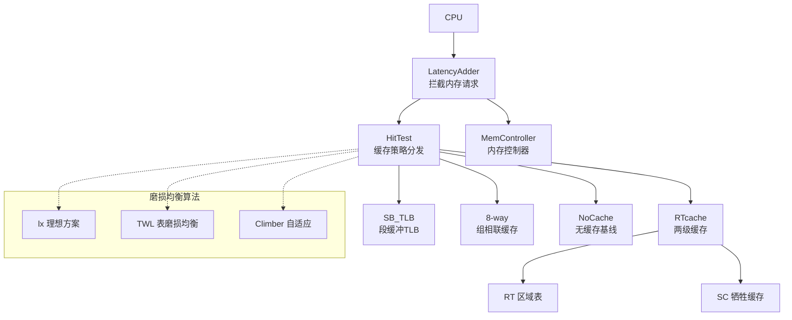
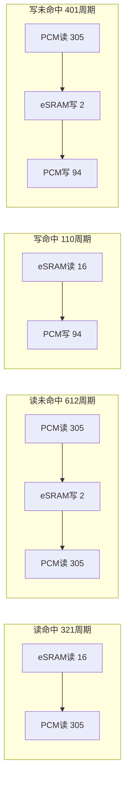
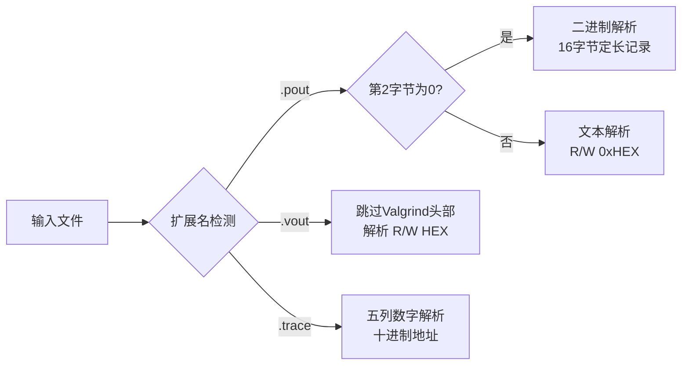

# RTcache：混合 PCM/eSRAM 内存系统的区域表缓存

RTcache 是一个用于研究混合 PCM（相变存储器）+ eSRAM/HBM 内存架构中**重映射表缓存加速**的仿真框架。提供 **gem5 集成模块**（全系统仿真）和**独立 trace 驱动工具**（快速评估）两种使用方式。

## 背景

PCM 具有高密度和非易失性，但存在写耐久性有限和读写延迟不对称的问题。磨损均衡算法通过周期性地交换热页和冷页来平衡物理单元的写入次数，但由此产生的页面重映射表本身也需要存储在 PCM 中——导致每次内存访问都有额外开销。

RTcache 通过将重映射表条目缓存在小而快速的 eSRAM/HBM 缓冲区中来加速访问，使大多数请求无需额外的 PCM 查找即可解析。

## 核心特性

- **4 种缓存策略**：
  - `RTcache`（type 1）：基于区域的两级缓存（RT + 牺牲缓存 SC）— 核心贡献
  - `SB_TLB`（type 2）：利用物理连续性的段缓冲 TLB
  - `8-way`（type 3）：传统组相联页缓存
  - `NoCache`（type 0）：无缓存基线

- **3 种磨损均衡算法**：
  - `lx`（type 0）：理想方案 — 全局交换最热和最冷页
  - `TWL`（type 1）：基于表的磨损均衡，生命周期感知配对
  - `Climber`（type 2）：按区域自适应探索交换候选

- **区域条目（RE）设计**：将页面分组（8/16/32/64）以减少元数据开销
- **牺牲缓存（SC）**：捕获最近被淘汰但仍活跃的条目
- **预取支持**：区域条目内的组级预取
- **动态 RT 调整**：基于淘汰质量的运行时区域组大小自适应

## 架构概览



## 延迟模型

gem5 LatencyAdder 根据访问结果注入精确的周期延迟：



| 事件 | 延迟公式 |
|------|---------|
| 读命中 | eSRAM_read(16) + PCM_read(305) = **321 周期** |
| 读未命中 | PCM_read + eSRAM_write(2) + PCM_read = **612 周期** |
| 写命中 | eSRAM_read + PCM_write(94) = **110 周期** |
| 写未命中 | PCM_read + eSRAM_write + PCM_write = **401 周期** |
| 磨损均衡(2页交换) | 2×PCM_read + 32×PCM_read/write + 2×PCM_write |
| 磨损均衡(3页交换) | 3×PCM_read + 48×PCM_read/write + 3×PCM_write |

## 仓库结构

```
gem5-modify-11.1/
├── src/learning_gem5/part2/              # gem5 集成 RTcache 模块
│   ├── latency_adder.cc/hh              # LatencyAdder SimObject
│   ├── LatencyAdder.py                   # gem5 SimObject 参数定义
│   ├── SConscript                        # 构建注册
│   └── RTcache/                          # 缓存与磨损均衡实现
│       ├── rtcache.cc/hh                 # RTcache：RT + SC 两级缓存
│       ├── hit_test.cc/hh               # 缓存策略分发器
│       ├── SB_TLB.cc/hh                 # SB-TLB
│       ├── _way_cache.cc/hh             # N路组相联基线
│       ├── climber.cc/h                  # Climber 磨损均衡
│       ├── twl.cc/h                      # TWL 磨损均衡
│       ├── no_cache.cc/hh               # 无缓存基线
│       ├── lx.cc/hh                      # 理想磨损均衡
│       └── life_4G.dat                   # 页面生命周期分布（4GB）
│
├── configs/deprecated/example/diy.py     # gem5 SE 模式仿真配置
├── configs/common/Options.py             # 扩展命令行参数
├── src/mem/simple_mem.cc/hh              # 修改后的 SimpleMemory
├── src/mem/SimpleMemory.py               # 扩展 SimpleMemory 参数
│
├── rtcache-cpp/                          # 独立 trace 驱动仿真器
│   ├── Makefile                          # 构建配置
│   ├── hit_test.cpp                      # 主入口 + 命令行解析
│   ├── rtcache.cc/hh                     # RTcache 核心（独立版）
│   ├── SB_TLB.cc/hh                     # SB-TLB（独立版）
│   ├── _way_cache.cc/hh                 # N路缓存（独立版）
│   ├── climber.cc/h                      # Climber 磨损均衡
│   ├── twl.cc/h                          # TWL 磨损均衡
│   ├── no_cache.cc/hh                   # 无缓存基线
│   ├── lx.cc/hh                          # 理想磨损均衡
│   ├── gen_life_distribution.py          # 页面生命周期数据生成
│   ├── cache3_hit.py                     # 命中率分析工具
│   ├── start.sh / rtcache.sh            # 批量实验脚本
│   ├── real_test.sh / spec_test.sh      # SPEC CPU 基准测试脚本
│   ├── micro_test.sh                     # 微基准测试脚本
│   └── run_pre.sh                        # 预取对比脚本
│
├── build/X86/gem5.opt                    # 预编译 gem5 二进制（X86）
└── README.md                             # 本文件
```

## 环境要求

- Ubuntu 20.04/22.04 LTS
- g++ 9.0+
- Python 3.6+
- Boost 库（`libboost-all-dev`，需要 `program_options`）
- gem5 额外依赖：SCons, protobuf, zlib, libgoogle-perftools

### 安装依赖

```bash
# 独立工具
sudo apt install -y build-essential libboost-all-dev

# gem5 额外依赖
sudo apt install -y git m4 scons zlib1g zlib1g-dev \
    libprotobuf-dev protobuf-compiler libprotoc-dev \
    libgoogle-perftools-dev python3-dev python-is-python3 pkg-config

# 生命周期数据生成
pip3 install numpy
```

## 快速开始

### 独立 trace 驱动仿真器

```bash
cd rtcache-cpp
make clean && make

# 查看所有参数
./test --help

# 运行 RTcache
./test --cache-type=1 --wl-type=0 --hbm-size=8192 \
       --rt-group=8 --pre=0 --swap-time=2048 \
       --input-file=/path/to/trace.pout
```

### gem5 集成仿真

```bash
# 编译 gem5（如未预编译）
scons build/X86/gem5.opt -j$(nproc)

# 启用 RTcache 运行
./build/X86/gem5.opt configs/deprecated/example/diy.py \
    --cmd=/path/to/benchmark \
    --mem-type=SimpleMemory \
    --hybird=true \
    --cache-type=1 --wl-type=0 --swap-time=2048 \
    --hbm-size=16kB --rt-group=8 --pre=0 --rt-dt=0
```

## 命令行参数

| 参数 | 默认值 | 说明 |
|------|--------|------|
| `--cache-type` | 1 | 缓存策略：0=无, 1=RTcache, 2=SB_TLB, 3=8路 |
| `--wl-type` | 0 | 磨损均衡：0=理想, 1=TWL, 2=Climber, 3=禁用 |
| `--hbm-size` | 8192 | HBM/eSRAM 缓存预算，KB（独立工具）或字节（gem5） |
| `--rt-group` | 8 | 每个区域条目的页数（8, 16, 32, 64） |
| `--swap-time` | 2048 | 触发磨损均衡交换的访问计数阈值 |
| `--pre` | 0 | 预取：0=禁用, 1=启用 |
| `--rt-dt` | 0 | 动态 RT 组调整：0=禁用, 1=启用 |
| `--ratio` | 0.75 | RT 与 SC 容量比（仅独立工具） |
| `--random-start` | 1 | SB_TLB 随机初始化 |
| `--input-file` | - | 输入 trace 文件路径（仅独立工具） |

## Trace 文件格式

独立工具根据文件扩展名和内容自动检测并支持 **4 种 trace 格式**：

### 1. `.pout` 文本格式（默认）

标准页级内存访问 trace，每行一次访问：

```
R 0x3c04ed6e80
W 0x3c04ed6f40 70060.487293
```

- `R`/`W` 表示读/写，后跟带 `0x` 前缀的十六进制地址
- 可选尾部时间戳（解析器忽略）

### 2. `.pout` 二进制格式（自动检测）

`.pout` 的二进制变体，当文件第 2 字节为 `\0` 时自动识别。每条记录 16 字节：

| 偏移 | 大小 | 内容 |
|------|------|------|
| 0-7 | 8 字节 | 操作符 `'R'`/`'W'` + 7 字节填充 |
| 8-15 | 8 字节 | 64 位小端序字节地址 |

### 3. `.vout` 格式（Valgrind/Callgrind 输出）

Valgrind `--tool=callgrind` 内存追踪输出。以 `==` 或 `--` 开头的头部行自动跳过：

```
==1129459== Callgrind, a call-graph generating cache profiler
==1129459== ...
[R 1fff000540 769387.698332]
[W 4002680 769387.745428]
```

- 数据行用 `[]` 包裹，十六进制地址无 `0x` 前缀
- 尾部时间戳（解析器忽略）

### 4. `.trace` 格式（数字列格式）

五列数字 trace 格式，使用十进制地址：

```
0 0 103040401408 8 1
9207 0 103040401920 8 1
1022483 0 140748214272 8 0
```

- 各列含义：`时间戳`  `列2`  `字节地址(十进制)`  `大小`  `读写标志`
- `读写标志`：`1` = 读, `0` = 写

### 格式检测流程



| 扩展名 | 类型 | 地址格式 | 读写编码 | 检测方式 |
|--------|------|---------|---------|---------|
| `.pout` | 文本 | 十六进制 `0x` | `R`/`W` 字符 | 扩展名 |
| `.pout` | 二进制 | 64位小端序 | `R`/`W` 字节 | 第2字节为 `\0` |
| `.vout` | 文本 | 十六进制无前缀 | `[R]`/`[W]` | 扩展名 |
| `.trace` | 文本 | 十进制 | `1`=读, `0`=写 | 扩展名 |

Trace 文件可通过 [trace_generator](https://github.com/dgist-datalab/trace_generator)、Valgrind/Callgrind 或 gem5 仿真捕获生成。

## 生成页面生命周期数据

TWL 和 Climber 磨损均衡算法需要预生成的页面生命周期分布：

```bash
cd rtcache-cpp
python3 gen_life_distribution.py 4G    # 4GB 地址空间（gem5）
# 生成 life_4G.dat（约17MB，约100万条目）
```

gem5 集成版使用 4GB 地址空间和 `life_4G.dat`。独立工具默认 256GB，需要 `life_256G.dat`。

## 批量实验

```bash
cd rtcache-cpp

# 扫描缓存类型和 HBM 大小
./start.sh /output/dir /path/to/traces/

# 运行 SPEC CPU 基准测试
./real_test.sh /output/dir /path/to/spec/traces/

# 预取对比实验
./run_pre.sh /output/dir /path/to/traces/

# 提取命中率
python3 cache3_hit.py
```

## 输出示例

```
$ ./test --cache-type=1 --hbm-size=8192 --input-file=gobmk.pout

CounterMap complete
gobmk.pout 67108864
hbm_size 8192
model init complete
Trace format: pout_text
rt hit: 0.966512 sc_hit : 0
Footprint: 5954
read_count: 99178
total_count: 179619
wear_leavl : 39
hit_rate : 0.966512
```

## 统计指标

- `hit_rate`：总体缓存命中率
- `rt_hit` / `sc_hit`：RT 和 SC 各自的命中率（仅 RTcache）
- `wear_leavl`：触发的磨损均衡交换总次数
- `Footprint`：访问的唯一页面数
- `read_count` / `total_count`：读访问和总访问计数
- gem5 额外报告：`Write_hit`, `Read_hit`, `Write_miss`, `Read_miss`, `WearLevel_1`, `WearLevel_2`

## 许可证

本项目基于 [gem5](https://www.gem5.org/)（BSD 许可证）。详见 [LICENSE](LICENSE)。
